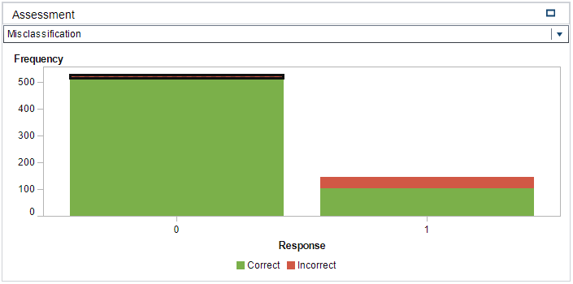

#*A study in logistic regression to evaluate viable predictors for life outcome of VLBW neonates.**

Abstract
--------

*According to the World Health Organization (WHO) low birth weight is defined as
a weight that is less than 2500g at birth. Throughout the world low birth weight
continues to be a considerable health problem . This paper reports on a
statistical investigation that was performed on a given SAS VA dataset, which
contains birth data from 671 neonates with birth weight less than 1500g. The
investigation seeks to understand if a statistical relevant relationship exists
between any of the predictive variables in the dataset and the survival rate of
low birth weight babies (null-hypothesis). A standard, methodical investigation
were performed on all the variables in the dataset and then utilized to build a
comprehensive logistic regression model. Several predictive variables were
identified as potential influencers in determining/predicting survival rates for
neonates and an interesting interaction effect was discovered, which all lend
credibility towards supporting the notion of rejecting the null-hypothesis.
Additionally, the results from the logistic regression analysis were compared to
a decision tree and it was found that the two classification techniques yielded
very similar results.*

Keywords: Logistic Regression, Low birth weight, SAS, Visual Analytics,
Statistical analysis, Low Birth Weight, Survival rate.

Introduction
------------

It is estimated that 15% to 20% of all births worldwide are low birth weight,
representing more than 20 million births a year. The WHO has set a goal to
reduce the number of these births by 3% per year between 2012 and 2025 .
Pre-term birth is the most common cause of neonatal mortality . Low birthweight
is a global concern as even some high-income countries face high rates of
pre-term births. There are numerous causes of low birth weight, including early
induction of labour or caesarean birth, multiple pregnancies, infections,
diabetes and high blood pressure . From an analytical point of view, numerous
low-income countries simply don’t weigh babies at birth and therefore analysts
are left with incomplete data. With the given dataset in SAS VA and the overall
drive from the WHO to minimize low birth weight incidences, it has motivated the
author to investigate if there is a relationship between several general
variables captured at birth and the survival rate of neonates. From this
background information and the idea that there should be a correlation between
conditional birth data and survival rate, the following hypotheses are drawn:

Null hypothesis: H0 : β1 = 0, β2 = 0, …, βn = 0

Alternative hypothesis: HA : at least one β-coefficient ≠ 0

where, β1, β2, …, βn represents the coefficients of a logistic regression model.
Logistic regression models have the capability to act as classification models
and therefore suitable for survival rate analysis (survival rate vs. death
rate). This document reports on a logistic regression method that evaluates the
above stated hypotheses and, in the process, seeks to better understand the
correlation between neonate survival rate and all the contributing variables as
listed in the given SAS VA dataset.

Data
----

The data for this statistical analysis were sourced from the SAS VA dataset
labelled, VERYLOWBIRTHWEIGHT, which is available under the Teradata University
Network. The dataset contains 671 rows, each representing the data captured for
a low birth weight neonate that was delivered at Duke University Hospital in
Durham, North Carolina between 1981 and 1987 . Each row consists of 26
dimensions (variables). In its raw form, the dataset contains 7
categorical-nominal variables and 19 quantitative numeric variables.

Early exploratory data analysis revealed that several of the quantitative
numerical variables could rather be classified as categorical variables as they
contained either 2,3,4 or 5 distinct values. After converting these variables to
categorical variables, the dataset presented with 10 quantitative numerical
variables and 16 categorical variables. All the categorical variables are
ordinal. Initial EDA revealed that few of the quantitative numerical variables
have semi-normal distributions. *Note: No QQ-Plot functionality was available in
SAS VA, therefore an informal “eye-ball” method was used by intuitively looking
at frequency plots (histograms) of said numerical variables*.

Two of the numerical variables, *lowph* and *bwt*, in the dataset presented
left-skewed distributions. For these variables two new calculated variables were
created, which applied the natural log function to normalize their
distributions. All recorded birth weights in the data is less than 1500g (except
for one entry – 1580g). The WHO classify a birth weight of less than 1500g as a
VLBW (Very Low Birth Weight) but, is still classified under the broader term of
“Low Birth Weight”.

The dataset indicates that only neonates with a gestation period between 22
weeks and 40 weeks were included in the study. Further EDA discovered a
significant amount of collinearity between the two variables *gest* and *bwt*.
The scatterplot in Figure 5 illustrates the linear relationship between the two
variables and a further ad-hoc linear regression analysis revealed a high
statistically significant correlation between the two variables. Therefore,
*gest* is omitted from the model. Table 2 and Table 3 as presented in APPENDIX
A, list the descriptive statistics for each of the variables in the dataset.
Several box-plots also suggested that there are no obvious outliers in the data
set for any of the variables.

Methods
-------

The SAS Visual Analytics software system, version: 7.4 Hotfix 05, was used to
analyse the data and build a logistic regression model. From Table 2 and Table 3
in Appendix B, the following variables were omitted from the analysis as they
were deemed irrelevant: *birth* (Date of Birth), *exit* (Date of Discharge),
*Year* (Study Year), *inout* (Born at Duke or transported). The logistic
regression algorithm was chosen to determine if there was a statistical
significant relationship between the response variable (*dead*) and all of the
other predictor variables as listed in Table 2 and Table 3. Logistic regression
is a natural choice when the response is categorical with two possible outcomes,
i.e. *dead=1 / dead=0*. For the response variable, “*dead=0*” (survival), was
chosen to be the outcome of the logistic regression model. We desire a model
that estimates the probability of survival as a function of the predictor
variables. The estimated probability of success has the form:

 (1),

as modelled on the Sigmoid function and where $$\eta = \$$β0 + β1X1 + β2X2 + … + βnXn. To calculate the probabilities from the sigmoid function we take the logit of the odds as follows (after some elementary algebraic manipulation):

 (2).

Equation (2) facilitates the functionality to express multiple predictors for the logistic regression model. To reject the null-hypothesis and to avoid committing a type I error, a significance level of 5% is chosen (α = 0.05). This implies that SAS VA should be able to fit the logistic regression model described in equation (2) in such a way that at least one of the β-coefficients ≠ 0 and be significant at the p-value = 5% (except β0, which serves as the intercept value). Internally, SAS VA utilizes the Maximum-Likelihood Function to achieve an optimal fit to the logistic regression model. The logistic regression model, as implemented by SAS VA, presented a conclusive statistical result. It should be noted, from Table 2 and Table 3, that the dataset contains a total of 1792 missing data elements - (659 quantitative numerical variables + 1133 categorical variables). This implies that for a total of 17446 data elements in the dataset (671 rows x 26 variables), a probability of missingness equals 10.2% ([1792/17446] x 100). Therefore, the percentage of intact data rows available =

 (3),

where, α = probability of missingness and k = number of inputs . The result generated by equation (3) suggests that only 6% of the data in the dataset is available with all 26 variable inputs populated. For this reason, it was
explicitly decided to turn on the “informative missingness” switch for the logistic regression model in SAS VA. (With the “informative missingness” switched off, SAS VA presented a very poorly fitted logistic regression
model.) For categorical variables with missing values SAS VA creates synthetic dummy variables and model for each level (minus one). For numerical variables with missing values, SAS VA imputes the missing values with the mean of the variable in question.

Results and Discussion
----------------------

SAS VA managed to successfully fit the logistic regression model, as
described in the Methods section, to the VERYLOWBIRTHWEIGHT dataset. SAS VA
utilized all 671 observations in the dataset. All predictor variables
presenting a p-value \> 5% were removed from the model. This left only 7
predictor variables, which in turn contributed to describing 46.2% of the
variance in the dataset (R-Squared = 0.4626). The decision to drop the
additional predictor variables (variables with p-values \> 5%) came at a
moderate cost – it caused the model’s R-Squared value to drop from 0.5260 to
0.4626. This, however, is seen as favourable as the parsimonious model is
much easier to interpret and presents deeper insight into the predictor
variables that contribute most to the model. From a bias-variance trade-off
point of view, by dropping redundant predictor variables, we lower the
model’s variance at the cost of a small amount of increased bias. Also, by
dropping unwanted predictor variables we lower the risk of overfitting the
model. The Fit Summary in Figure 1 lists the predictor variables that are
statistically significant and therefore are included in the logistic
regression model.



Figure 1 - Fit Summary

The variables’ associated coefficient values, as gained from the logistic regression model’s details windows in SAS VA, are listed in Table 1:

Table 1 - Logistic Regression Fit Variables

| **Predictor variable** | **Coefficient** | **p-value** |
|------------------------|-----------------|-------------|
| Ln – bwt               | β1=4.161        | \< 0.00001  |
| Pneumo                 | Β2=13.462       | \< 0.00001  |
| Vent                   | Β3=2.306        | 0.00208     |
| Cld                    | Β4=-14.693      | 0.00257     |
| Race                   | Β5=-2.658       | 0.00318     |
| Ivh                    | Β6=-1.810       | 0.00369     |
| Ln – lowph             | Β7=25.783       | 0.00495     |

From Table 1, equation (2) can now be re-written as follows:



(4)

where β0 represents the intercept value of the model and has the value of
-76.762, as read from the model’s details window in SAS VA. Equation (4) then
presents enough evidence to reject the originally stated null-hypothesis (H0) as
it conclusively demonstrates that at least one of the β-coefficients ≠ 0.

All the default property values were used for the SAS VA logistic regression
model. The quality of the fitted model can be assessed by interpreting Figure 2,
Figure 3 and Figure 4 in Appendix B. From the Lift plot in Figure 2 it can be
observed that the fitted model compares well with the best possible model,
especially up until the 30-40 percentile of the cumulative response variable.
From the ROC plot in Figure 3 it can be observed that the model has a high level
of sensitivity with a maximum separation KS-Statistic of 0.746. This is a
favourable value as it represents the ability of the model to withstand Type I
errors. The latter notion is supported by the Misclassification plot in Figure 4
where it can be visually confirmed that the model has a very low rate of false
positives (i.e. the response variable was modelled on *dead=0*). Therefore, the
low false rate for the 0 event (live). Lastly, an additional positive point
regarding dropping unnecessary variables, is that it increases the degrees of
freedom of the model, which in broader terms should add to the flexibility and
descriptiveness of the model. From the Fit Summary in Figure 1 it can be
observed that there are two predictor variables that contributes significantly
to the probability outcome of the response variable. These two variables are:
*ln-bwt* (birth weight) and *pneumo* (Pneumothorax occurred – collapsed lung).
When *ln-bwt* and *pneumo* is added as an interaction effect (*ln-bwt\*pneumo*)
instead of standalone effects, the R-squared value marginally increases to
0.4629. The variables *ln-lowph* and *cld* presents with large coefficients and
a further step in optimisation of the model might be to apply a shrinkage method
such as LASSO.

Conclusions
-----------

From the results we have learned that there is indeed a statistically
significant relationship between the survival rate of very low birth weight
babies and seven of the predictor variables in the dataset (reason for rejecting
H0).

It is interesting to note that the predictor variables, which surfaced as most
important by the regression analysis are all related to respiratory problems of
VLBW neonates. This makes sense as birth weight is closely related to the
gestation period of the neonate. A short gestation period naturally concludes
that the neonates’ respiratory system did not have enough time to fully develop
and therefore, the probability of experiencing respiratory distress syndrome is
much higher . This then leads to the need for assisted ventilation (*vent*)
after birth and the probability of staying longer on oxygen support (*cld*)
after birth. Respiratory problems cause many of the internal organs to work
harder and can in turn influence the neonates’ blood pH levels (*lowph*).
Numerous articles have been written on the subject and there is nothing new that
this regression model can illustrate that has not been researched by the medical
community. However, it is interesting to observe that the logic regression model
did succeed in highlighting all the relevant factors in the dataset (*vent, cld,
lowph, pneumo and bwt*), which according to medical literature, contributes
significantly to VLBW neonates’ survival rates.

It should also be noted that the *race* predictor made it into the final
logistic regression model. This predictor can only be properly understood in the
light of socio-economic subclasses. For instance, in societies with lower
socio-economic levels the probability is higher for alcohol and drug mis-use and
can therefore translate into shorter gestation periods of neonates, which in
turn results in lower birth weight. However, for this study we can only take the
socio-economic idea into account for the greater Durham community in North
Carolina.

Finally, the VERYLOWBIRTHWEIGHT dataset is also suitable for analysis by
utilising a decision tree model. Therefore, the author also created a decision
tree model on the dataset and the findings were very similar to the logistic
regression model. By comparing the decision tree model to the logistic
regression model, SAS VA determined that the logistic regression is the more
accurate model as based on the Misclassification, K-Statistic, FPR and
C-Statistic values. As a final note – the decision tree assists greatly in
better understanding the dataset as it gives a very clear indication of which
variables plays a major role in the survival rate of neonates.

It is suggested that further analysis takes place on the VERYLOWBIRTHWEIGHT
dataset whereby extracted Lead IDs from a decision tree model is added to the
logistic regression model in order to further enhance the descriptiveness and
robustness of the logistic regression model.

Appendix A
==========

Table 2: Quantitative Numerical Variables

| **No**    | **Variable** | **Description**                | **Min**   | **Max** | **Mean** | **σ**  | **Missing** |
|-----------|--------------|--------------------------------|-----------|---------|----------|--------|-------------|
| 1         | apg1         | Agar score                     | 0.00      | 9.00    | 4.90     | 2.63   | 34          |
| 2         | birth        | Date of Birth                  | 81.51     | 87.48   | 84.75    | 1.60   | 21          |
| 3         | bwt          | Birth weight (grams)           | 400.00    | 1580.00 | 1093.89  | 265.22 | 2           |
| 4         | exit         | Date of Death/Discharge        | 68.53     | 96.87   | 84.84    | 1.79   | 31          |
| 5         | gest         | Gestational age (weeks)        | 22.00     | 40.00   | 28.87    | 2.55   | 4           |
| 6         | hospstay     | Hospital stay (number of days) | \-6574.00 | 3668.00 | 40.36    | 304.84 | 31          |
| 7         | lol          | Duration of labour (hours)     | 0.00      | 192.00  | 8.44     | 19.26  | 381         |
| 8         | lowph        | Lowest pH in first 4 days      | 6.53      | 7.55    | 7.2      | 0.14   | 62          |
| 9         | pltct        | Platelet count (109/L)         | 16.00     | 571.00  | 201.62   | 80.55  | 70          |
| 10        | Year         | Study year                     | 81.51     | 87.48   | 84.76    | 1.60   | 21          |
| **TOTAL** | **659**      |                                |           |         |          |        |             |


Table 3: Categorical Variables

| **No**    | **Variable** | **Description**                                      | **Distinct Count** | **Values**                                      | **Missing** |
|-----------|--------------|------------------------------------------------------|--------------------|-------------------------------------------------|-------------|
| 1         | cld          | On oxygen at 30 days                                 | 2                  | 1=Yes, 0=No                                     | 66          |
| 2         | dead         | Life status                                          | 2                  | 1=Live, 0=Dead                                  | 0           |
| 3         | magsulf      | Mother treated with MgSO4                            | 2                  | 1=No, 2=Yes                                     | 247         |
| 4         | meth         | Mother treated with beta-methasone                   | 2                  | 1=No, 2=Yes                                     | 106         |
| 5         | Pda          | Patent ductus arteriosusdetected                     | 2                  | 1=No, 2=Yes                                     | 29          |
| 6         | pneumo       | Pneumothorax occurred                                | 2                  | 1=No, 2=Yes                                     | 26          |
| 7         | toc          | Tocolysis – Mother treated with beta-adrenergic drug | 2                  | 1=No, 2=Yes                                     | 106         |
| 8         | twn          | Multiple gestation                                   | 2                  | 1=No, 2=Yes                                     | 20          |
| 9         | vent         | Assisted ventilation used                            | 2                  | 1=No, 2=Yes                                     | *30*        |
| 10        | delivery     | Abdominal or Vaginal                                 | 2                  | 1=Abdominal, 2 = Vaginal                        | 22          |
| 11        | inout        | Born at Duke or transported                          | 2                  | 1=Duke, 2=Transported                           | 3           |
| 12        | ipe          | Periventricular intraparenchymal echodense lesion    | 3                  | 1=Absent, 2=Definite, 3=Possible                | 144         |
| 13        | ivh          | Intraventricular hemorrhage                          | 3                  | 1=Absent, 2=Definite, 3=Possible                | 144         |
| 14        | pvh          | Periventricular hemorrhage                           | 3                  | 1=Absent, 2=Definite, 3=Possible                | 144         |
| 15        | race         | Race                                                 | 4                  | 1=Black, 2=White, 3=Native American, 4=Oriental | 25          |
| 16        | sex          | Gender                                               | 2                  | 1=Male, 2=Female                                | 21          |
| **TOTAL** | **1133**     |                                                      |                    |                                                 |             |

Appendix B
==========



Figure 2 - Lift Plot



Figure 3 - ROC Plot



Figure 4 - Misclassification Chart



Figure 5 - Scatterplot - bwt vs. gest



